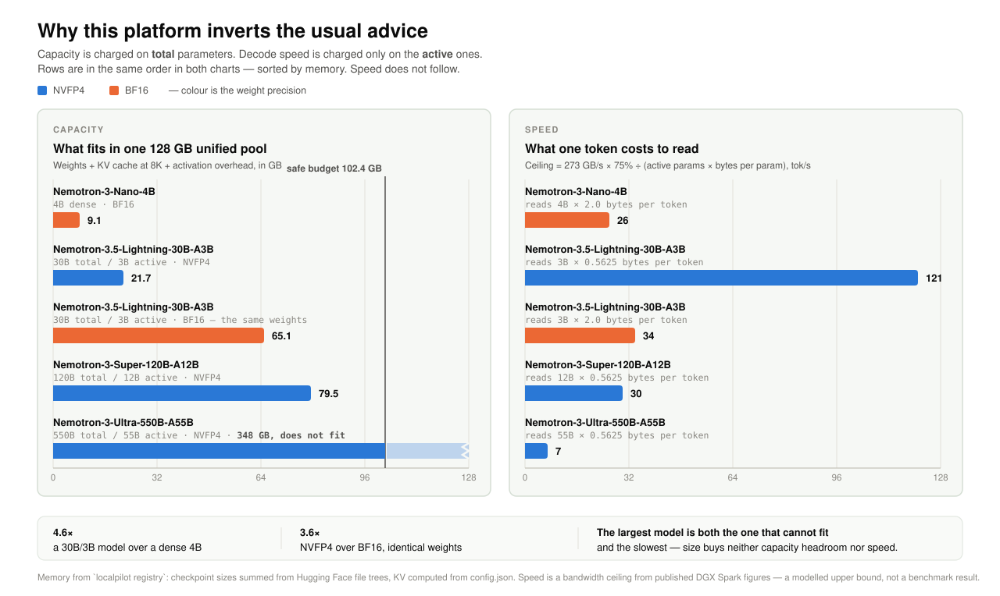
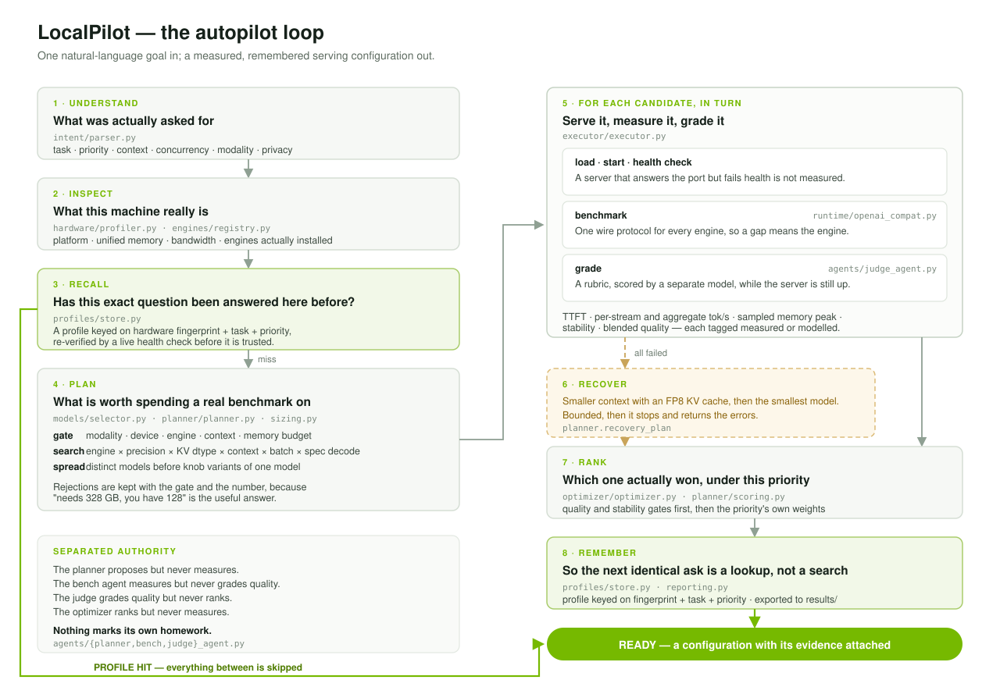
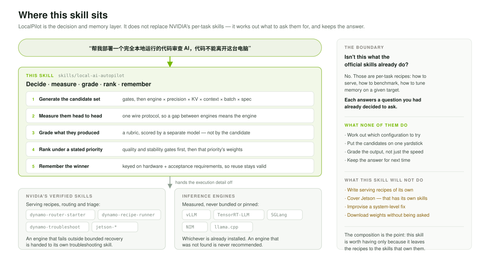

# LocalPilot

**AI that configures AI.** Say what you want to run locally. LocalPilot picks
the engine, the precision and the serving configuration, measures the
candidates against each other on your machine, and remembers the winner.

Built for Apple Silicon, NVIDIA DGX Spark and other CUDA targets, and shipped with an
[Agent Skill](.agents/skills/local-ai-autopilot/SKILL.md) so a coding agent can
drive the whole loop. See the [Agent behavior benchmark](BENCHMARK.md) for the
current baseline-versus-Skill result and its remaining discovery failure.

## The problem

A DGX Spark gives you 128 GB of unified memory and roughly 1 PFLOP of FP4
compute in a desktop box. Then it asks you nine questions before the first
token:

which engine (vLLM, TensorRT-LLM, SGLang, a NIM container, llama.cpp),
which checkpoint, at NVFP4 or FP8 or BF16, whether the weights plus the KV
cache fit a pool shared with the operating system, what context length, what
batch width, whether to run speculative decoding, whether to quantize the KV
cache, and how to benchmark any of it comparably.

**The tuning intuition you carried over from a datacentre GPU is wrong here.**
Capacity is generous and bandwidth is not, so decode is bandwidth-bound long
before it is compute-bound. Three consequences, each of which LocalPilot
turns into a searchable axis:

| Consequence | Why |
|---|---|
| A bigger model can decode faster | Generating a token reads every *active* weight once. A 30B model with 3B active outruns a dense 9B. |
| NVFP4 is faster than BF16, not just smaller | Fewer bytes per token to read. |
| Speculative decoding is the biggest single-stream win | It spends idle compute to cut memory passes — and stops paying once batching claims that compute. |

From the shipped registry, sized for a 128 GB unified pool:

```
model                                        params   prec  weights   tok/s  fits
nemotron-3.5-lightning-30b-a3b-nvfp4         30B/3B  NVFP4    20.1G     121  yes
nemotron-3.5-lightning-30b-a3b-bf16          30B/3B   BF16    61.3G      34  yes
nemotron-3-super-120b-a12b-nvfp4           120B/12B  NVFP4    74.8G      30  yes
nemotron-3-nano-4b-bf16                          4B   BF16     7.4G      26  yes
nemotron-3-ultra-550b-a55b-nvfp4           550B/55B  NVFP4   328.1G       7  NO
```

The 4B dense model is the slowest thing that fits. That is the platform, and
it is why guessing does not work.



## What LocalPilot does

```
Understand → Inspect → Plan → Execute → Measure → Grade → Rank → Remember
```

Three agents with deliberately separated authority. The planner may propose
but never measure. The bench agent may measure but never grade quality. The
judge may grade quality but never rank. Nothing marks its own homework.



```
$ localpilot autopilot "帮我部署一个完全本地运行的代码审查 AI，代码不能离开这台电脑，响应速度优先"

  configuration                                    ttft    tok/s   mem   score
  ------------------------------------------------------------------------------
 *nemotron-3.5-lightning-30b-a3b-nvfp4-trtllm-spec  63m    215.4  23.7G   96.7
  nemotron-3-nano-30b-a3b-nvfp4-trtllm              62m    121.8  20.4G   84.8
  nemotron-3-super-120b-a12b-nvfp4-trtllm           63m     30.2  82.6G   58.6
  nemotron-3.5-lightning-30b-a3b-bf16-vllm          76m     31.5  68.6G   27.5

What the run showed
  - 215 vs 122 tok/s (1.8x) with speculative decoding on vs off
  - 122 vs 30 tok/s (4.0x) with active parameters 3 vs 12, and 62 GB less memory
  - nemotron-3-ultra-550b-a55b-nvfp4 was rejected before anything ran:
    needs 348.0 GB but only 102.4 GB is safely available
```

Every comparison names the axes on which the pair differed. A ratio between
configurations that differ in three things is not evidence about any one of
them, and LocalPilot will not present it as such.

The winner is written to a profile keyed on the hardware fingerprint and the
parsed acceptance requirements: task, privacy, priority, quality, context,
concurrency, capabilities, modalities and languages. **The next equivalent
request is a lookup; a changed requirement triggers a new search.**

## Quick start

Codex discovers the project-local Skill directly from `.agents/skills/`.
Verify it, or install the same canonical Skill for another supported agent:

```bash
python3 .agents/skills/local-ai-autopilot/scripts/install.py status --json
python3 .agents/skills/local-ai-autopilot/scripts/install.py install \
    --agent claude-code --target .
```

The installer also supports `cursor`, `gemini`, `codex`, and `all`. It will
not overwrite an unmanaged or locally modified Skill directory. It installs
only the Skill files; install the LocalPilot Python package separately on the
controller and every execution node, then verify `localpilot --version`.

### Platform-independent controller and execution targets

The controller can be any computer that runs Python, the Agent, and SSH. The
execution target can be that same machine or a remote node. Apple Silicon uses
Metal through Ollama; NVIDIA nodes use their detected CUDA engines.

```bash
# Inspect the current execution target.
localpilot doctor --json

# Run real local inference when a supported engine and model are present.
localpilot autopilot "local chat assistant, quality first" \
  --mode ollama --json

# Inspect the machine that will actually run the models.
localpilot --target ssh://pilot@dgx-spark doctor --json

# Run the complete search and acceptance loop on that node.
localpilot --target ssh://pilot@dgx-spark \
  autopilot "本地发票识别，质量优先" --mode vllm --json
```

The remote node needs SSH access and its own LocalPilot installation. If the
executable is inside a virtual environment, pass its path with
`--remote-command`, or set `LOCALPILOT_REMOTE_COMMAND`. Hardware inspection,
engine processes, profiles, and reports stay on the execution node. Passwords
must not be placed in the target URI; use the normal SSH authentication path.

No CUDA device needed to see the whole loop:

```bash
python3 -m localpilot.cli doctor                  # what this machine is
python3 -m localpilot.cli registry --task coding --simulate  # simulated DGX sizing
python3 -m localpilot.cli demo --mode mock        # the A/B story
python3 -m localpilot.cli autopilot "local code review AI, latency first" \
    --mode mock --trace

# Evaluate an aggregated runtime observation without changing the service.
python3 -m localpilot.cli reconcile --metrics runtime-metrics.json --json
```

Mock mode is a roofline simulation: its numbers are derived from memory
bandwidth and active parameters per token, are labelled `simulated: true`
throughout, and are never reported as measurements.

### Dashboard

```bash
python3 -m pip install -e ".[api]"
python3 -m localpilot.cli serve          # http://127.0.0.1:8000/
```

Hardware panel, live agent trace, candidate comparison, the rejections and
their reasons, and the remembered profiles. Everything is inline — a
local-only tool whose UI needs a CDN would contradict itself.

### Real hardware

LocalPilot measures every engine through its OpenAI-compatible HTTP surface,
which is what makes a cross-engine comparison mean something: TTFT and
inter-token latency are observed identically whether the server is vLLM,
TensorRT-LLM, SGLang or a NIM container.

Point it at a server you already run:

```bash
export LOCALPILOT_VLLM_BASE_URL=http://127.0.0.1:8000
localpilot autopilot "local code review AI, latency first" --mode vllm
```

Or let it start one, which is opt-in because starting an engine downloads
weights:

```bash
export LOCALPILOT_ALLOW_ENGINE_LAUNCH=1
```

Without either, LocalPilot refuses and prints the exact command it would have
run. One checkpoint in this registry is 328 GB; nothing gets pulled by
accident.

Rubric grading needs a separate endpoint, because a model cannot certify its
own answers:

```bash
export LOCALPILOT_JUDGE_BASE_URL=http://127.0.0.1:8009
```

See [`.env.example`](.env.example) for every variable.

## Commands

```
localpilot doctor        this machine: platform, memory, bandwidth, engines
localpilot --version     installed CLI version for prerequisite checks
localpilot engines       engine catalogue, knobs, and what was found
localpilot registry      models sized against this machine's budget by default
localpilot recommend     plan candidates without executing anything
localpilot autopilot     the full loop from a natural-language goal
localpilot stage         measure and save a candidate without activating it
localpilot deploy        autopilot by task and priority
localpilot optimize      the same, for re-tuning
localpilot benchmark     re-measure the active profile
localpilot status        the active configuration
localpilot profiles      what has been remembered
localpilot report        export a run to results/ as Markdown and JSON
localpilot demo          the A/B story
```

`--json` everywhere output is meant to be parsed.
[`references/cli.md`](.agents/skills/local-ai-autopilot/references/cli.md) is the
full contract.

The default deliverable is an engine configuration, a direct-engine request
example, and acceptance evidence. Applications can call vLLM or Ollama directly.
The existing `serve`, `reconcile`, `watch`, `drain`, `activate`, `rollback`,
`resume` and `stop` commands remain auxiliary features; they are not prerequisites
for configuration handoff. Their contract is in
[optional service management](.agents/skills/local-ai-autopilot/references/service-management.md).

## The Agent Skill

`.agents/skills/local-ai-autopilot/` is the decision and memory layer for a
coding agent. It can **compose with** specialised NVIDIA, Jetson, or engine
troubleshooting Skills when a matching Skill is discoverable in the current
Agent environment. Otherwise it preserves the evidence, reports the boundary,
and gives the next concrete step instead of assuming that dependency exists.
The optional routing contract lives in
[`references/composition.md`](.agents/skills/local-ai-autopilot/references/composition.md).

The Skill guides target inspection, candidate selection, task acceptance and
configuration handoff. It uses explicit quality/time gates, deterministic field
checks or separately identified rubric evidence, and bounded comparisons when
needed. Saved configurations may be reused only while their requirements and
acceptance evidence remain valid. See
[optimization](.agents/skills/local-ai-autopilot/references/optimization.md) and
[handoff](.agents/skills/local-ai-autopilot/references/handoff.md).

A runnable [document extraction handoff](examples/document-extraction/README.md)
shows how an application calls vLLM directly with the validated prompt and JSON
schema, using only Python's standard library. A separate
[20-image synthetic holdout](evals/documents/holdout-v1/README.md) checks the fixed
strategy on new inputs without retuning it or claiming another optimization gain.



## Architecture

```
localpilot/
  intent/        natural language → task, priority, context, concurrency, modality
  hardware/      Apple Metal, CUDA and DGX Spark detection, engine probing
  sizing.py      memory model and the bandwidth roofline
  engines/       engine catalogue: knobs, features, launch templates
  models/        registry and gating, with every rejection kept
  planner/       candidate generation over engine x precision x context x batch
  runtime/       one OpenAI-compatible harness per engine, plus the simulation
  executor/      per-candidate lifecycle: load, start, verify, measure, stop
  agents/        planner, bench and judge, with separated authority
  optimizer/     priority-weighted ranking behind quality and stability gates
  profiles/      profile memory keyed on hardware + acceptance requirements
  api/           dashboard, jobs, OpenAI-compatible endpoints
  web/           the dashboard, no external assets
docs/
  essay.md                   the competition write-up: outline and data slots
  devlog.md                  the daily journal it draws on
  architecture-loop.svg      the loop, and the path that skips it
  architecture-platform.svg  why capacity and speed come apart here
  architecture-skill.svg     where this skill sits in the ecosystem
config/
  models.yaml    checkpoints, with provenance for every number
  engines.yaml   engines, knobs, launch templates
  devices.yaml   platform detection and characteristics
  policies.yaml  priority weights, search space, gates, roofline constants
  benchmark.yaml prompt set, and the canned answers mock mode returns
```

The runtime boundary is an abstract six-method provider, so a new engine is a
subclass and a config entry rather than a change to the orchestration.

## Evidence

`profiles/` and `logs/` are machine state and stay out of version control.
`results/` is the opposite: `localpilot report` exports a run there as
Markdown plus its raw JSON, and those are committed, because a measurement
nobody can review is not evidence.

```bash
localpilot autopilot "..." --mode vllm --no-reuse
localpilot report                 # writes results/<stamp>-real-<task>-<priority>.md
```

The filename carries `-real-` or `-sim-`, the report states the label above
the numbers, and every comparison in it names the axes on which the pair
differed.

The initial committed DGX Spark image-path evidence is
[`results/20260921T124614-real-vision-quality.md`](results/20260921T124614-real-vision-quality.md).
It records three real image requests and an all-fields match on a deterministic
three-color image. This validates the image request path; it does not establish
invoice OCR accuracy or a comparison between models.

For document-field acceptance, the optional
[`evals/documents`](evals/documents/README.md) dataset contains six synthetic
invoice images and 30 labeled fields. Set `LOCALPILOT_BENCHMARK_CONFIG` to its
`benchmark.json` to select it. The evaluator checks exact JSON keys, values,
and types, counts failed requests as incorrect, and reports field and whole
document accuracy separately. Expected answers never enter inference payloads.
The benchmark configuration hash is part of profile matching, so changing the
test set invalidates reuse of an older acceptance result.

Optional `acceptance` settings in that benchmark config let you choose
`fastest_complete` with a `min_quality` floor, or `highest_quality` under a
`max_total_latency_ms` budget. Candidates must pass the gates before selection.
Without these settings, existing priority-weighted ranking is preserved.
See [bounded optimization](docs/bounded-optimization-zh.md) for configuration
examples and the limits of the evidence.

The [real document run](results/20260921T130219-real-vision-quality.md) matched
30/30 fields across 6/6 synthetic documents on DGX Spark. Three separate timing
requests averaged 949.58 ms to first token and 12,353.37 ms to completion.
These small-sample results do not establish production invoice accuracy or
configuration optimization; see the
[validation scope](results/20260921-document-field-validation.md).

A subsequent [paired output-strategy experiment](results/20260921-output-strategy-comparison.md)
changed only `response_format`: mean complete response fell from 9.764 s to
3.138 s, with 60/60 fields correct in each arm (six synthetic images, two
repetitions). This is reduced generation work on a warm service, not a GPU
decode-speed claim. The selected strategy also passed a separate standard
autopilot acceptance run; its reusable benchmark config is linked in the report.

## How the measurement is taken

Details that decide whether the numbers mean anything:

- **Concurrent streams get different prompts.** Firing the identical
  request N times at a server with prefix caching on measures the cache:
  every stream after the first skips prefill, and aggregate throughput
  lands far above what real users would see.
- **`max_new_tokens` is 256, not 64.** At 64 tokens a ~60 ms TTFT is over a
  tenth of the measurement and the decode rate is estimated from 63
  samples.
- **Peak memory is sampled during generation**, every 250 ms via NVML, and
  the maximum is kept. Reading it once at the end reports whatever happens
  to be resident after the work finished. When NVML is unavailable the
  planner's estimate is used and `raw.peak_memory_source` says so.
- **The first token is excluded from the decode rate.** It is
  time-to-first-token; counting it would blend prefill into a generation
  figure.
- **Warmup runs are discarded**, because the first request pays for graph
  capture and cache warmup.

## What is honest about the numbers

- `hardware.simulated` and `benchmark.simulated` must both be false before a
  result is a measurement. `READY` with `simulated: true` is a development
  result.
- `score` is normalized across the candidates of one run. It ranks within that
  run on that machine and is not portable.
- `memory_estimate` is pre-flight. `benchmark.peak_memory_gb` is observed only
  when `raw.peak_memory_source` identifies an engine or sampled pool; a
  planner fallback remains an estimate.
- `quality` blends a keyword signal with a rubric grade. A null
  `quality_judge` means no judge was reachable and the quality figure is weak —
  the profile records that rather than hiding it.
- `config/models.yaml` carries a `_provenance` block: which numbers are
  measured file sizes, which are derived from `config.json`, and which are
  priors. Every entry stays `unverified_on_target` until a real run on the
  target writes a profile.

## Safety

- No implicit weight downloads, driver installs, PATH changes or system
  service edits.
- `doctor`, `profile`, `engines` and `registry` are read-only.
- The API binds to 127.0.0.1.
- Logs record execution metadata, not prompts, code or model output.
- `stop` touches only LocalPilot state; weights and profiles survive.

## Tests

```bash
python3 -m unittest discover -s tests
```

Real-hardware results remain target-specific. Apple Silicon and DGX Spark
profiles have different hardware fingerprints and are never reused across
targets.

## Status

The orchestration, search space, sizing model, agents, scoring, profile
memory, CLI, API and dashboard are implemented and tested. The real-execution
path is implemented against the OpenAI-compatible surface of Ollama, vLLM,
TensorRT-LLM, SGLang, NIM and llama.cpp. Local and SSH execution use the same
acceptance loop while keeping each target's evidence separate.
